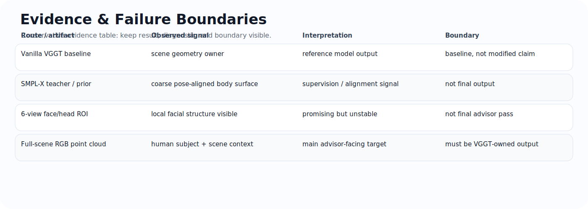

<!--
README rewrite generated for a resume/portfolio-facing research repository.
Style goal: closer to public research project READMEs: clear motivation, baseline delta,
architecture, contribution boundary, evidence gallery, results/status, and reproducible usage.
-->
# VGGT-SMPL-X Human Prior Adapter

<p align="center">
  
</p>

<p align="center">
  <b>Human-structure prior injection for VGGT-style visual geometry.</b><br/>
  VGGT backbone · SMPL-X prior rendering · dense prior maps · geometry supervision · full-scene evidence gate
</p>

<p align="center">
  <a href="README_CN.md">中文说明</a> ·
  <a href="#motivation">Motivation</a> ·
  <a href="#what-is-new-compared-with-vggt">Delta from VGGT</a> ·
  <a href="#architecture">Architecture</a> ·
  <a href="#evidence-gallery">Evidence</a> ·
  <a href="#current-status">Status</a>
</p>

<p align="center">
  
  
  
  
</p>

## Motivation

[VGGT](https://github.com/facebookresearch/vggt) is a feed-forward visual geometry model that predicts camera parameters, depth maps, point maps, and tracks from one or more input views. This repository starts from that baseline contract and asks a narrower question:

> Can a VGGT-style geometry model use a human body prior to produce a clearer human-region 3D structure, without simply replacing the output with an SMPL-X template?

The target is not a pretty 2D overlay. The target is a **VGGT-owned human-main full-scene RGB point cloud**, where the human is recognizable while scene context is still retained.

## What is new compared with VGGT

| Layer | Upstream VGGT baseline | This repository |
| --- | --- | --- |
| Input | Multi-view RGB images | Multi-view RGB + optional view-aligned human-prior maps |
| Geometry output | Cameras, depth, point maps, tracks | Same VGGT-owned output path; SMPL-X is only prior/supervision |
| Human structure | No explicit body topology | SMPL-X silhouette / depth / point / normal / body-part priors |
| Training signal | Generic visual geometry supervision | Human ROI geometry supervision and failure-closed controls |
| Evaluation | Scene-level geometry tasks | Human-main full-scene RGB point-cloud evidence gate |

## Architecture

<p align="center">
  
</p>

### Data and model path

```text
Multi-view RGB + camera parameters
        │
        ├── VGGT backbone
        │       ├── camera prediction
        │       ├── depth prediction
        │       └── point-map prediction
        │
SMPL-X parameters / fitted human prior
        │
        └── view-aligned prior rendering
                ├── prior_maps
                ├── prior_depths
                ├── prior_points
                ├── prior_normals
                └── prior_mask
                         │
                         ▼
                  HumanPriorAdapter
                         │
                         ▼
            VGGT-owned human-aware scene geometry
                         │
                         ▼
        human-main full-scene RGB point-cloud evidence
```

## My work

- Designed the **SMPL-X prior route** around `prior_maps`, `prior_depths`, `prior_points`, and `prior_mask` instead of using SMPL-X as a direct final output.
- Built the project narrative around the VGGT baseline: keep VGGT as the geometry owner, and let the human prior act as a structure signal.
- Separated **teacher / prior / diagnostic** evidence from **student/model-owned** output.
- Added conservative evaluation rules: metric pass, visual pass, and advisor pass are different gates.
- Recorded failure boundaries around pseudo-positive cases, including point-count increase without reliable Open3D geometry improvement.
- Used the 6-view face/head ROI re-audit to decide that more loss terms alone are not enough; the next route needs stronger local geometry representation or a learned residual branch.

## Evidence gallery

<p align="center">
  
</p>

<p align="center"><sub>6-view face/head ROI re-audit. Local facial structure is visible, but continuity and stability are not yet enough for final advisor-pass evidence.</sub></p>

<p align="center">
  
</p>

<p align="center"><sub>External teacher/reference routes are used for camera, mask, and teacher-quality audits. They are not student model outputs.</sub></p>

<p align="center">
  
</p>

## Checked routes and lessons

| Route | What it tested | Safe conclusion |
| --- | --- | --- |
| projected targetpatch / summary-token patch | whether the model can use localized target-view evidence | useful diagnostic, not enough alone |
| point-normal / human-crop finetuning | local detail supervision | can improve local signals but not guaranteed full-scene geometry |
| TeacherGeom / ROI combo | teacher-driven human geometry | sensitive to teacher continuity and alignment |
| NormalBae / Sapiens / DepthAnything / DepthPro controls | external geometry reference quality | reference only; not student output |
| high-confidence baseline preservation | prevent destroying existing VGGT geometry | necessary for conservative improvements |

## Evidence standard

| Level | Meaning | Can be promoted? |
| --- | --- | --- |
| Metric pass | A loss or numerical score improves. | No, not alone. |
| Visual pass | A local or diagnostic view looks better. | Useful, but still not final. |
| Advisor pass | Human-main full-scene RGB point cloud shows a clearer body under the same view/bounds. | Yes, main target. |

## Current status

This repository is an active research route. The safe current claim is:

> The project establishes a VGGT-compatible SMPL-X prior injection and supervision route, plus a conservative evidence gate for human-main full-scene 3D geometry. Some local 6-view face/head results are promising, but the final clear, continuous, stable human-main point-cloud target has not yet been fully reached.

## Citation / upstream credit

This repository builds on the public VGGT project and should be understood as an adapter / research-route exploration, not as the original VGGT method.

```bibtex
@inproceedings{wang2025vggt,
  title={VGGT: Visual Geometry Grounded Transformer},
  author={Wang, Jianyuan and Chen, Minghao and Karaev, Nikita and Vedaldi, Andrea and Rupprecht, Christian and Novotny, David},
  booktitle={Proceedings of the IEEE/CVF Conference on Computer Vision and Pattern Recognition},
  year={2025}
}
```
