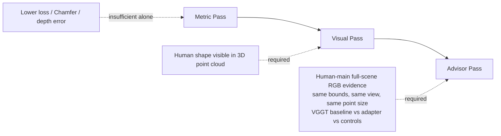
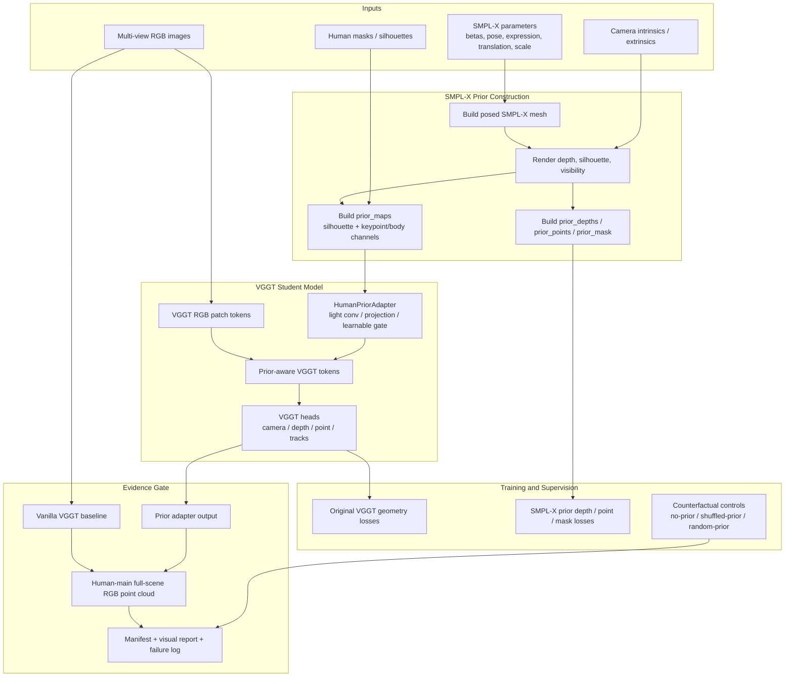
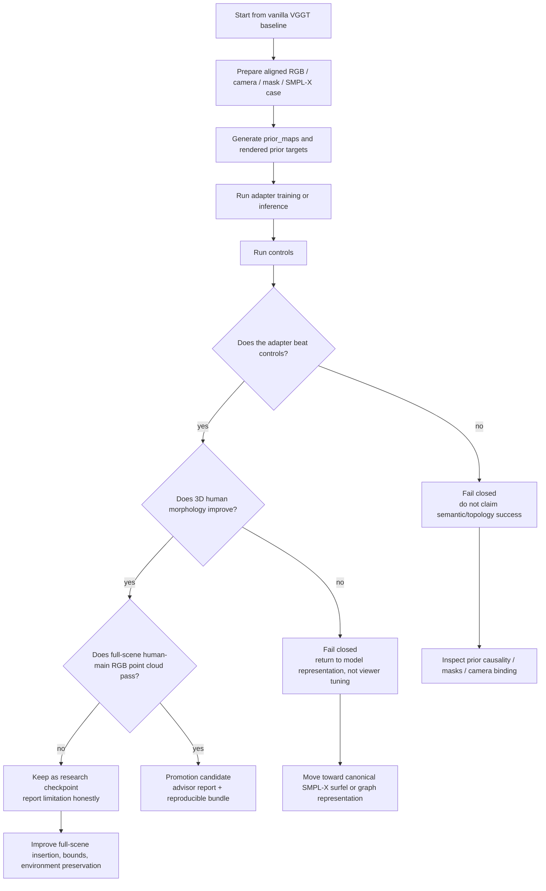
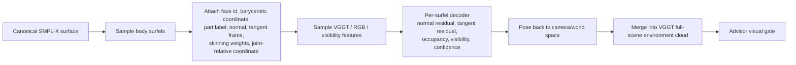

# VGGT-SMPL-X Human Prior Adapter

An evidence-gated research adapter for injecting **SMPL-X human topology priors** into **VGGT** while keeping VGGT's original goal: general multi-view scene geometry. This repository is not a finished human reconstruction product and should not be presented as an advisor-pass result until the full visual gate is satisfied.

The core idea is simple: VGGT already predicts cameras, depth, point maps, and tracks from RGB images, but it does not explicitly know that a human body should preserve head, torso, limbs, hands, feet, and body-part connectivity. SMPL-X provides that missing topology prior. This project explores how to encode that prior into VGGT-compatible inputs, token features, supervision targets, and evidence reports without replacing VGGT with a pure SMPL regressor.

---

## Project Position

This repository is the **model-side human-prior adapter** in the VGGT + SMPL-X project family.

| Repository | Role |
|---|---|
| `VGGT-SMPL-X-Human-Prior-Adapter` | Model adapter, SMPL-X prior injection, token/feature supervision, evidence-gated training route. |
| `VGGT-ZJU-Mocap-Adapter` | ZJU-MoCap data bridge, camera/mask/SMPL alignment, reproducible dataset conversion and diagnostics. |
| `vggt_for_4k_4d` | 4K4D/DNA-Rendering-oriented VGGT case preparation, full-scene evidence generation, baseline/control packaging. |

This repository should be read as the place where the **student model route** is developed. Dense Kinect fusion, raw depth fusion, or SMPL-X-only reconstruction may be used as teachers, references, or diagnostics, but they are not the final student output.

---

## What This Repository Is and Is Not

### This repository is

- A research route for making VGGT aware of SMPL-X human structure.
- A place to test `prior_maps`, SMPL-X-rendered depth/point targets, feature adapters, and token-level priors.
- A framework for comparing VGGT baseline outputs against human-prior-enhanced outputs.
- An evidence-gated workflow that separates metric improvement from visual success.
- A stepping stone toward a canonical SMPL-X surfel or graph representation inside a VGGT-compatible pipeline.

### This repository is not

- A completed product for watertight human mesh reconstruction.
- A pure SMPL-X parameter regressor.
- A viewer-only or post-processing-only solution.
- A place to package teacher-only dense fusion as a model result.
- A success claim unless the advisor visual gate is passed by a full-scene RGB point cloud.

---

## Mentor Visual Gate

The highest evaluation gate for this project is the advisor-facing visual requirement:

> The main evidence image must be a **full-scene RGB point cloud** or **human-main scene point cloud** where the human body is the subject, part of the surrounding environment is preserved, and the human morphology is readable by eye: head, torso, limbs, hands/feet, and overall pose should be identifiable.

The following are useful diagnostics but cannot be used as the main success evidence:

- isolated human scatter plots,
- body-part close-ups,
- projection overlays,
- masks or heatmaps,
- SMPL-only renderings,
- Kinect/raw-depth teacher fusion,
- RBF prototypes,
- viewer screenshots that hide the full-scene geometry problem.

A model result can be promoted only when it passes all three levels:



---

## High-Level Architecture

The adapter keeps RGB as the main VGGT input and adds human priors through side channels, token features, or supervision targets. This avoids changing VGGT's pretrained RGB patch embedding in an unsafe way.



---

## Why SMPL-X Is Used

SMPL-X is used because it gives a stable human topology prior:

- head / torso / limb connectivity,
- body-part structure,
- hands and expressive body support,
- differentiable body surface representation,
- compatibility with camera projection and multi-view supervision.

However, SMPL-X is not treated as the final answer. It cannot fully represent hair, loose clothing, carried objects, and scene context. The project goal is to use SMPL-X as a **prior** so that VGGT's scene geometry becomes more human-structured while still preserving RGB scene evidence.

---

## Research Workflow



---

## Evidence Standards

Every experiment should distinguish the following roles and pass levels.

### Teacher vs Student

| Term | Meaning | Can be final result? |
|---|---|---|
| Dense teacher | Raw depth, Kinect fusion, or observation-verified dense reference used for supervision or diagnosis. | No. |
| Prototype baseline | Fast experimental baseline such as compact RBF or SMPL-only visualization. | No. |
| VGGT baseline | Original VGGT output without human prior. | Baseline only. |
| Student adapter | VGGT output after the human-prior adapter path. | Candidate only if visual gates pass. |

### Pass Levels

| Level | Requirement | Failure mode |
|---|---|---|
| Metric pass | Numeric losses or geometry metrics improve over baseline. | May still be a blob, shell, or sheet. |
| Visual pass | 3D point cloud visibly has human structure. | Projection overlay alone is not enough. |
| Advisor pass | Human-main full-scene RGB point cloud passes same-view comparison against VGGT baseline and controls. | Isolated human evidence is not enough. |

---

## Canonical Surfel Direction

Earlier free-point or residual decoder routes can produce numeric improvement while still generating blob-like or sheet-like 3D morphology. The next stronger route is a canonical SMPL-X surfel or graph representation:



This direction is preferred when the current adapter improves metrics but still fails to produce readable 3D human morphology.

---

## Recommended Repository Outputs

A strong experimental run should produce:

- `source_manifest.json` or equivalent input manifest,
- baseline VGGT point cloud evidence,
- adapter point cloud evidence,
- control runs: no-prior, random-prior, shuffled-prior, SMPL-only, smoothing-only where applicable,
- same-view full-scene RGB point cloud comparison,
- metric report,
- visual report,
- failure report when gates are not passed,
- upload-safe bundle that excludes large datasets, private assets, caches, and licensed body model files.

---

## Expected External Assets

This repository should not include private or licensed assets. Users must obtain them separately where required:

- VGGT weights according to the original VGGT license and release terms,
- SMPL-X model files according to the official SMPL-X license,
- dataset files such as 4K4D/DNA-Rendering or ZJU-MoCap data according to their own terms,
- local camera calibration and masks where applicable.

A common local SMPL-X layout used in development is:

```text
D:/body_models/smplx/SMPLX_NEUTRAL.npz
D:/body_models/smplx/SMPLX_NEUTRAL.pkl
```

Do not commit these body model files to the repository.

---

## Minimal Usage Pattern

The exact scripts may evolve, but the recommended workflow is:

```text
1. Prepare a small multi-view case with RGB, masks, cameras, and SMPL-X parameters.
2. Build prior_maps and rendered SMPL-X targets.
3. Run vanilla VGGT to create a baseline.
4. Run the human-prior adapter route.
5. Run counterfactual controls.
6. Generate full-scene RGB point cloud evidence with the same bounds and view.
7. Write manifests, reports, and failure notes before claiming any improvement.
```

---

## Reporting Template

Advisor-facing reports should use the following structure:

1. Conclusion first.
2. Architecture diagram.
3. Route position.
4. Why the previous route was insufficient.
5. Changes in this round.
6. Experimental closure and reproducibility.
7. VGGT baseline / adapter / controls comparison.
8. Full-scene point cloud visual evidence.
9. Environment preservation and projection diagnostics.
10. Boundary, failure cases, and next route.
11. Files for advisor review.

---

## Current Status

This project should currently be treated as a **research prototype / evidence-gated adapter route**. It is suitable for documenting the SMPL-X prior integration idea, building controlled experiments, and preparing advisor-facing evidence. It should not be described as a completed advisor-pass human point cloud reconstruction system unless the full-scene visual evidence gate is satisfied.

---

## Project Change Log

### 2026-05-27

- Added a full English README.
- Added Mermaid architecture and workflow diagrams.
- Clarified the repository boundary: model-side SMPL-X human-prior adapter for VGGT.
- Added teacher/student, metric/visual/advisor pass, and full-scene point cloud evidence gates.
- Documented the canonical SMPL-X surfel direction as the preferred next route when free-point or residual decoder outputs fail visually.

---

## Acknowledgements

This project builds on the research ideas and released resources around VGGT, SMPL-X, multi-view human capture, and scene-level 3D reconstruction. Please follow the licenses of the upstream projects, datasets, and body model assets before using or redistributing any code, weights, or data.
