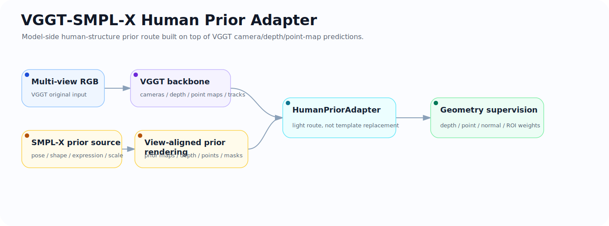
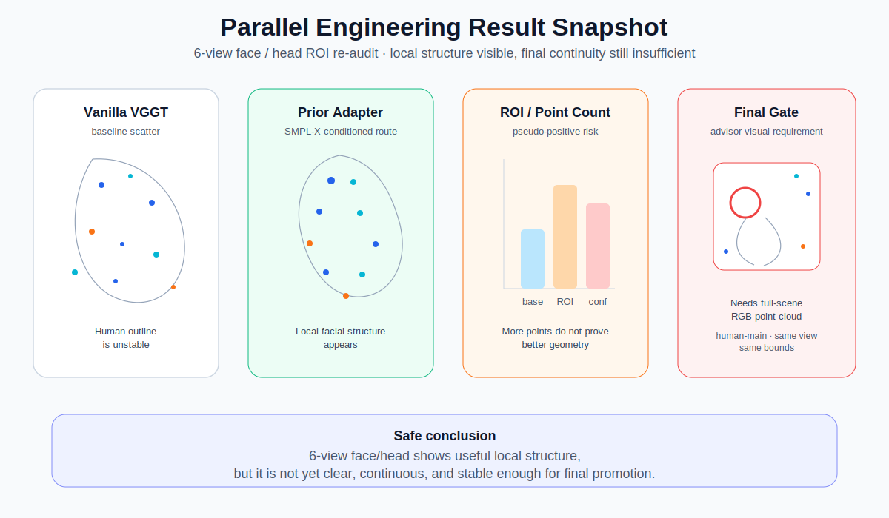
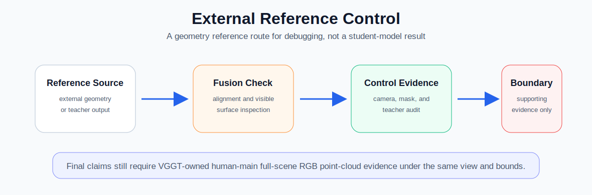

# VGGT-SMPL-X Human Prior Adapter 中文说明

<p align="center">
  
</p>

<p align="center">
  <a href="README.md">English README</a> ·
  <a href="#项目一句话">项目一句话</a> ·
  <a href="#和原版-vggt-的关系">和原版 VGGT 的关系</a> ·
  <a href="#我具体做了什么">我具体做了什么</a> ·
  <a href="#成果图怎么读">成果图怎么读</a> ·
  <a href="#失败边界">失败边界</a> ·
  <a href="#面试时怎么讲">面试时怎么讲</a>
</p>

<p align="center">
  
  
  
  
</p>

## 项目一句话

这个仓库记录的是一条 **VGGT + SMPL-X 人体结构先验** 的模型侧实验路线：在保留 VGGT 原本相机、深度、点图、轨迹预测能力的基础上，尝试把 SMPL-X 提供的人体拓扑结构变成可对齐、可监督、可审计的人体先验信号，帮助模型在人体区域生成更清楚、更连续、更可解释的三维几何。

它不是“把 SMPL-X 模板直接贴到点云里”。  
SMPL-X 在这里是 prior / teacher / supervision source，最终能不能成立，仍然要看 **VGGT student route** 产生的 full-scene RGB point cloud。

---

## 和原版 VGGT 的关系

原版 VGGT 可以从单张、多张或多视图 RGB 图像中直接预测：

- 相机参数；
- 深度图；
- point map；
- track / correspondence；
- 后续可导出 COLMAP 或接入 Gaussian Splatting 类流程。

这类 feed-forward visual geometry model 对普通场景很强，但在人体区域会遇到一个问题：  
人体不是普通刚体。头、躯干、手臂、腿、手脚之间有明显拓扑结构。如果只看 depth loss、point loss 或投影 overlay，可能出现“指标看起来还行，但三维点云里人体仍然像壳、片、团、blob”的情况。

本仓库的改动重点就是：

| 原版 VGGT / baseline | 本仓库增加的路线 |
| --- | --- |
| RGB 输入为主 | 保留 RGB，同时增加人体先验输入 |
| 输出 camera / depth / point map / track | 在人体区域增加 prior depth / prior point / prior mask 监督 |
| 通用场景几何模型 | 加入 SMPL-X 人体拓扑先验 |
| 指标和可视化通常分开看 | 明确 metric pass / visual pass / advisor pass |
| 点云后处理容易被误判 | 要求 human-main full-scene RGB point cloud 作为主证据 |

---

## 我具体做了什么

### 1. 设计 SMPL-X prior 的接入方式

项目不是简单调用 SMPL-X，而是把 SMPL-X 放进 VGGT 的训练/评估链路中：

```text
多视角 RGB + 相机参数
        │
        ├── 原版 VGGT backbone
        │        └── cameras / depth / point maps / tracks
        │
SMPL-X pose / shape / translation / scale
        │
        └── 真实相机下的 prior rendering
                 ├── prior_maps
                 ├── prior_depths
                 ├── prior_points
                 ├── prior_normals
                 └── prior_mask
                          │
                          └── HumanPriorAdapter / supervision route
                                   │
                                   └── VGGT-owned human-aware point prediction
                                            │
                                            └── full-scene RGB point cloud evidence
```

核心思路是：**SMPL-X 提供人体结构参考，VGGT 仍然负责模型输出。**

### 2. 设计 prior maps / prior depth / prior point 数据链路

我围绕人体区域构造了几类先验：

- `prior_maps`：图像空间的人体提示，例如 silhouette、关键点/部位提示等；
- `prior_depths`：通过 SMPL-X mesh 在真实相机下渲染得到的人体区域深度；
- `prior_points`：由深度和相机参数反投影得到的人体点参考；
- `prior_normals`：局部表面方向，用于约束几何方向；
- `prior_mask`：限定哪些像素/区域可以参与人体先验监督。

这些先验必须和真实 RGB、mask、camera intrinsic/extrinsic、VGGT 输出坐标保持一致，否则很容易得到看似可视化正常、实际三维错位的伪结果。

### 3. 建立 teacher / student / prototype / diagnostic 的边界

这个项目反复踩过的坑是：很多东西看起来像成果，但不能当最终成果。

| 类型 | 能做什么 | 不能做什么 |
| --- | --- | --- |
| SMPL-X / Kinect / external teacher | 作为 dense teacher、参考、诊断 | 不能当 student 输出 |
| projection overlay | 检查相机和投影是否大致对齐 | 不能证明 3D 点云正确 |
| isolated human scatter | 看局部人体点分布 | 不能作为导师主图 |
| ROI / crop / face close-up | 排查头部和手部局部问题 | 不能替代 full-scene point cloud |
| VGGT student output | 才是模型路线输出 | 必须通过 full-scene 视觉门控 |

### 4. 做过的路线排查

并行实验里排查过多条方向：

- projected targetpatch / summary-token patch；
- point-normal / human-crop finetuning；
- TeacherGeom / ROI combo；
- confidence collapse：ROI 点数增加但 Open3D 或 confidence threshold 后反而更差；
- NormalBae、Sapiens、DepthAnything、DepthPro 等外部 teacher 参考；
- 6-view face/head ROI 复核；
- full-scene human-main visual gate。

得到的阶段性结论是：当前瓶颈不只是脚本或 viewer，而是 **高质量、连续、对齐的人体局部几何 teacher 不够稳定**，以及需要更强的 **learned 3D residual / feature-conditioned local geometry branch**。

---

## 成果图怎么读

<p align="center">
  
</p>

<p align="center"><sub>6-view face/head ROI 复核结果：局部面部结构已经能看到，但连续性和稳定性还没有达到最终要求。</sub></p>

这张图不要理解成“最终成功图”。它更准确的意义是：

- 说明 6-view 设置下，局部 facial/head ROI 有可见结构；
- 说明先验和多视角路线能产生一定局部收益；
- 同时也暴露出点云连续性、稳定性和 full-scene 主图要求之间还有差距；
- 因此它是 **visual diagnostic / partial visual pass candidate**，不是 advisor pass。

<p align="center">
  
</p>

<p align="center"><sub>外部几何参考路线只用于相机、mask、teacher 质量排查，不作为 student 输出。</sub></p>

这张图的意义是控制组和 teacher 质量审计。它能帮助判断相机、mask 和参考几何是否合理，但不能写成“我的 VGGT 模型输出已经成功”。

---

## 失败边界

本项目采用 fail-closed 原则：

- 如果 full-scene RGB point cloud 里看不出人体结构，不能写 advisor pass；
- 如果 projection overlay 像人，但 3D 点云仍是 blob/sheet，不能写 3D 成功；
- 如果 random / shuffled prior 和 true prior 接近，不能写人体语义因果成立；
- 如果 teacher 比 student 更像人，不能写模型成功；
- 如果只完成 viewer、截图、局部 crop，不能替代模型表示重构。

后续更合理的方向是：

- real 3D learned residual；
- multi-view detail supervision；
- baseline high-confidence detail preservation；
- SMPL feature-conditioned local geometry branch；
- canonical SMPL-X surfel / graph representation；
- human-main full-scene visual gate。

---

## 面试时怎么讲

可以这样概括：

> 我这个项目不是直接把 SMPL-X 贴到 VGGT 输出上，而是把 SMPL-X 当作人体结构先验，构造成和真实相机对齐的 prior maps、prior depth、prior points、prior normals 和 prior mask，再通过 adapter / supervision route 让 VGGT 在人体区域获得结构参考。项目过程中我重点做了数据链路、teacher/student 边界、baseline/control 设计和 full-scene point cloud evidence gate。当前阶段不能夸大成最终成功，但它清楚暴露了 sparse-view 人体几何恢复中 teacher 质量、相机对齐、人体拓扑和视觉证据标准之间的关系。

可追问点：

- 为什么不能直接用 SMPL-X 替换点云？
- prior maps 和 prior points 分别解决什么问题？
- projection overlay 为什么不能证明 3D 成功？
- metric pass / visual pass / advisor pass 有什么区别？
- 为什么下一步要转向 canonical surfel / graph representation？

---

## 成果展示页面

- 成果展示页面：https://www.yuque.com/maturinlove221/gqr279/emwf87ku108nzvez
- 成果展示页面：https://www.yuque.com/maturinlove221/gqr279/fg8lq33tgbwiagtt

---

## 当前状态

这个仓库是一个 active research route。  
它的价值不在于“已经解决 VGGT 人体点云”，而在于把 **VGGT baseline、SMPL-X prior、dense prior maps、adapter/supervision route、teacher/student 边界和 full-scene evidence gate** 串成了一条可复盘的研究工程路线。

---

## 保留图片

本次 README 只重排和补充文字说明，不替换原有图片文件：

```text
docs/figures/vggt_smplx_human_prior_adapter_architecture.svg
docs/figures/parallel_engineering_result_snapshot.svg
docs/figures/external_reference_control.svg
```
