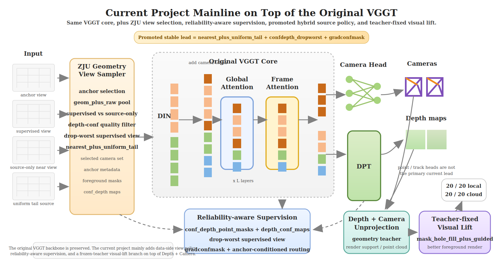

# 当前项目新主线讲解

这份说明只借用你发来 `PPT` 的排版思路和讲述节奏，内容全部基于当前项目这条新代码主线，不再沿用之前那条失败改造路线的模块定义。

当前版本新架构图文件：



## 1. 总览

先看原版 `VGGT` 的核心架构图：


原版可以概括成一条很干净的主链：

`输入多视图 -> DINO token -> 全局/帧内交替注意力 -> Camera Head + DPT Head -> cameras / depth / point / track`

当前项目的新主线不是推翻这个架构，而是在它外面补上了一层面向 `ZJU` 的训练与评估闭环。

如果用和 PPT 类似的“新增模块”口径来讲，现在真正成立的模块可以概括成 5 块：

1. `原版 VGGT 前向`
   - 保留原论文里的 backbone、camera head、depth head 主体。

2. `ZJU Geometry 数据引擎`
   - 把 ZJU 多视图样本整理成适合当前训练的输入单元。
   - 不只是读图，还会决定哪些视图做监督、哪些视图只做 source。

3. `可靠性深度监督`
   - 不再把所有 depth supervision 等价使用。
   - 会按 `conf-depth`、视图质量、前景区域来决定哪些监督更值得信。

4. `Hybrid Source Policy`
   - 当前稳定主线不再是纯最近邻视图，而是“最近邻为主，再补一个更均匀的 tail 视图”。
   - 这是现在 promoted stable lead 的核心变化。

5. `Teacher-Fixed Visual Lift`
   - 用冻结下来的稳定几何 teacher 做可视化重建，再对低权重空洞区域做修复。
   - 这是当前展示效果最直接的一层。

所以当前项目的实际流程更像是：

```text
原版VGGT
  -> ZJU多视图采样与source policy
  -> reliability-aware depth/camera训练
  -> 形成promoted stable lead
  -> 冻结teacher做visual lift评估与展示
```

---

## 2. 模块一：原版 VGGT 主干没有变

这部分最好讲得简单、明确：

- 主干还是原版 `VGGT`
- 主输出还是 `camera + depth`
- 当前项目并不是换了一个全新的 3D 网络

原论文里有两个对现在这条主线特别重要的结论：

1. 训练时联合预测 `camera / depth / point` 是有帮助的。
2. 推理时，用 `Depth + Camera` 反投影得到的 3D points，往往比直接使用 `Point Head` 更准。

论文第 8 页 `ETH3D` 的结果就是这个意思：

- `Ours (Point)`：`Overall = 0.709`
- `Ours (Depth + Cam)`：`Overall = 0.677`

也就是说，当前项目始终坚持 `depth + camera -> 几何重建` 这条主线，其实是和原版论文结论一致的，不是另起炉灶。

---

## 3. 模块二：ZJU Geometry 数据引擎

当前项目真正新增的第一层，不是 loss，而是数据组织方式。

在 `ZJU` 里，一个训练样本不再只是“读进来几张图”这么简单，而是会同时决定：

- 哪个视图是 `anchor`
- 哪些视图属于 `supervised views`
- 哪些视图属于 `source-only views`
- 当前这一组视图采用什么 `source policy`

这层设计的意义是：

- 原版 VGGT 更偏通用多视图输入
- 当前项目要面对的是 ZJU 这种“人像、视角环绕、背景和地面容易出问题”的数据
- 所以必须在进入模型前，就把视图角色分清楚

当前稳定主线用的不是最早的纯局部策略，而是：

`nearest_plus_uniform_tail`

它的直观意思是：

- 大部分 source view 仍然保持最近邻，保证局部几何稳定
- 但至少留一个更均匀分布的 tail view，避免全部视图都挤在局部邻域里

这一步本质上是在解决：

> 视角如果太局部，depth 反投影出来的几何更容易被某一侧背景和地面模式牵着走。

---

## 4. 模块三：可靠性深度监督

这部分是当前项目最关键的一层，也是最适合回答导师“ground truth depth 可能不准”这个问题的地方。

### 4.1 先说结论

现在的方案不是“把所有 depth 真值当绝对标准”，也不是“直接全局砍掉低置信度深度”。

而是：

> depth 监督继续用，但要分层使用，只让更可靠的像素和更可靠的视图主导训练。

### 4.2 当前主线怎么做

这一层可以概括成 3 个关键词：

1. `confdepth`
   - 每个像素不是只有“有/没有深度”，还会带一个深度可靠性信号。
   - 这个信号不会简单粗暴地决定“删不删”，而是参与监督路由。

2. `dropworst`
   - 如果当前样本里有多个 supervised views，不是全部平等使用。
   - 可以把其中 `depth_conf` 最差的那一个视图剔掉。
   - 这样做的目的，是减少坏监督视角把整体训练带偏。

3. `gradconfmask`
   - 梯度类深度损失只在更可信的区域里重点起作用。
   - 避免不可靠区域的梯度项把边界和平滑关系学歪。

### 4.3 这和“全局阈值过滤”有什么区别

你们其实已经做过“全局阈值过滤”的实验，而且结果是否定的。

也就是说，项目后面并没有把“老师怀疑 depth 不准”理解成：

> 那就给 depth 加一个硬阈值，低于某个置信度全部删掉。

因为那样虽然会让某些深度指标看起来变好，但会伤到 `camera/T/reg_depth` 这些更关键的联合指标。

所以最后保留下来的，是更柔和、更结构化的处理方式：

- 不完全相信所有 depth
- 但也不粗暴删掉一大片 depth
- 而是让可信信号主导、不可信信号降权

---

## 5. 模块四：Hybrid Source Policy 是当前 stable lead 的核心

这部分最适合回答导师第二个问题：

> “depth 转换的点云地面背景区域可能不利”到底怎么解决了？

### 5.1 不是先改显示，而是先改 source policy

当前真正升成 stable lead 的，不是简单的 mask 修补，也不是单独的底部裁剪，而是：

`nearest_ring -> nearest_plus_uniform_tail`

这一步的本质是：

- 以前 source 更局部
- 现在保留局部稳定性的同时，强制引入更均匀的远一点视角

它解决的不是“背景直接消失”，而是：

> 让几何支撑不要全部被局部近邻背景控制，从而减少地面/远背景错误在反投影点云里的放大。

### 5.2 为什么说它是当前真正的主解

因为它不是一个“看起来合理”的想法，而是真正赢下了当前主线对比。

相对上一版稳定方案，promoted lead 在长门上的结果是：

| 指标 | 上一版 stable lead | 当前 promoted stable lead |
| --- | ---: | ---: |
| val camera | 0.0219 | 0.0044 |
| val T | 0.0003 | 0.0001 |
| val conf_depth | 0.2288 | -0.1678 |
| val reg_depth | 0.1759 | 0.0207 |

这说明它不是只改善了某一个局部指标，而是当前联合目标下真正更稳。

### 5.3 从点云探针看，它确实收紧了坏背景扩散

项目里还做了 point-cloud probe，对 promoted lead 和旧方案做了直接对比。

结果不是“新方案点更多”，而是：

- 点云更紧
- 外扩更少
- 半径更小

代表性结果：

| 指标 | 旧方案 | promoted lead |
| --- | ---: | ---: |
| valid_points | 24655 | 14682 |
| pointcloud_radius_p95 | 2.5785 | 0.2555 |

所以更准确的讲法不是：

> 新方案把背景全重建好了

而是：

> 新方案让点云分布更收敛，减少了坏背景和地面点的大范围扩散。

这和导师的担心是高度对齐的。

---

## 6. 模块五：Teacher-Fixed Visual Lift

这部分是当前项目里最像“展示层模块”的一层，也是最适合拿来汇报效果的部分。

### 6.1 它做的不是重新训练几何，而是修复显示质量

当前 visual lift 的输入不是随机几何结果，而是：

- 先用当前 promoted stable lead 形成冻结的 geometry teacher
- 再把 teacher 输出的 `Depth+Camera` 渲染结果做可视化修复

当前选出来的最优 variant 是：

`mask_hole_fill_plus_guided`

它的直观逻辑是：

1. 先看 `Depth Weight`
   - 哪些区域支撑权重大、哪些区域是低权重空洞

2. 再看 `FG Mask`
   - 只在前景主体附近做更积极的修复

3. 最后做两步组合
   - `mask_hole_fill`：补掉低权重空洞
   - `guided`：对原始 depth 渲染和模糊引导结果做加权融合

所以它不是“重新算几何”，而是：

> 在不破坏已有几何主结构的前提下，把前景里最容易出现裂缝、断层、空洞的地方修得更能看。

### 6.2 当前 benchmark 结果

本地和云端的 `20 case` benchmark 结果是一致的：

| 指标 | 本地 | 云端 |
| --- | ---: | ---: |
| improved masked count | 20 / 20 | 20 / 20 |
| mean dL1(masked) | -0.036762 | -0.037903 |
| improved full count | 20 / 20 | 20 / 20 |
| mean dL1(full) | -0.004124 | -0.004184 |

这说明：

- 它不是只挑几个 case 有效
- 也不是只在 mask 内部看着好
- 而是本地和云端都稳定成立

---

## 7. 导师两个问题，放到当前新主线里怎么回答

### 7.1 问题一：`ground truth depth 在这个 ZJU 数据集可能不准`

当前项目的处理思路可以概括成一句话：

> 不再把 ZJU depth 当作完全可靠的硬真值，而是让可靠像素和可靠视图主导 depth supervision。

具体体现在三件事上：

1. 用 `confdepth` 判断像素级可靠性
2. 用 `dropworst` 丢掉最差 supervised view
3. 用 `gradconfmask` 让梯度监督集中在更可信区域

所以这个问题现在不是“靠某一个阈值解决”，而是“靠一整套 reliability-aware supervision 机制来缓解”。

### 7.2 问题二：`depth 转换的点云地面背景区域可能不利`

当前项目的处理思路也可以概括成一句话：

> 不是简单把底部裁掉，而是先通过 source policy 让点云支撑结构变稳，再在 visual lift 里对低权重前景空洞做显示修复。

具体分两层：

1. 上游几何层
   - `nearest_plus_uniform_tail`
   - 减少坏背景点云的大范围扩散

2. 下游显示层
   - `mask_hole_fill_plus_guided`
   - 修补前景低支撑空洞和断裂

所以这两个问题在当前项目里并不是各自孤立修，而是被串成了一条连续链：

`更稳的视图选择 -> 更稳的 depth supervision -> 更稳的 depth+camera teacher -> 更干净的 visual lift 展示`

---

## 8. 可视化效果怎么讲

### 8.1 例子一：典型 hero case


这张图可以按 PPT 的节奏这样讲：

- 第一行：
  - 左边是真实目标图
  - 中间 `Point Map` 在这个 case 基本不可用
  - 右边 `Depth+Camera` 是当前主链生成的原始渲染

- 第二行：
  - 左边 `Depth Weight` 显示了哪些区域支撑强、哪些区域支撑弱
  - 中间 `FG Mask` 给出前景主体范围
  - 右边 baseline 仍然有明显重影和空洞

- 第三行：
  - 中间 `mask_hole_fill_plus_guided` 之后，人物主体区域更完整
  - 右边 diff 还能看到残差，说明它不是“完美重建”
  - 但主体区域更干净、更稳定，展示效果明显提升

### 8.2 例子二：改善更明显的 case


这个 case 更能说明 visual lift 的意义：

- baseline 里人物主体有明显多重重影
- depth 权重图显示前景附近存在不少低支撑区域
- 修复后前景主体收得更紧，断裂感减轻

所以如果要一句话概括视觉效果：

> 当前结果不是把所有 ghost 全部消掉了，而是把“前景主体的可视化完整性”明显拉起来了。

---

## 9. 汇报时最建议的一段话

可以直接按下面这段讲：

> 我们现在不是沿着之前那条失败改造路线继续堆模块，而是回到原版 VGGT 的 `depth + camera` 几何主线，在它外面补了一层专门面向 ZJU 的训练和评估闭环。对“depth 真值可能不准”这个问题，我们没有再用简单硬阈值，而是改成 reliability-aware supervision，让可信像素和可信视图主导训练；对“depth 转点云后地面背景不利”这个问题，我们也没有只做底部裁剪，而是把 source policy 升级成 `nearest_plus_uniform_tail`，先让上游点云分布更收敛，再在下游用 `teacher-fixed visual lift` 修复前景低权重空洞。最后得到的是一条更稳定的几何主线，以及一套在本地和云端都验证通过的展示方案。 

---

## 10. 最后一句总结

当前项目和原版 VGGT 的关系，不是“换模型”，而是：

> 原版 VGGT 负责给出 `depth + camera` 这条几何主干；当前项目负责把这条主干在 ZJU 这样更难、更脏的人体多视图数据上，变得更稳、更可信、也更能展示。
